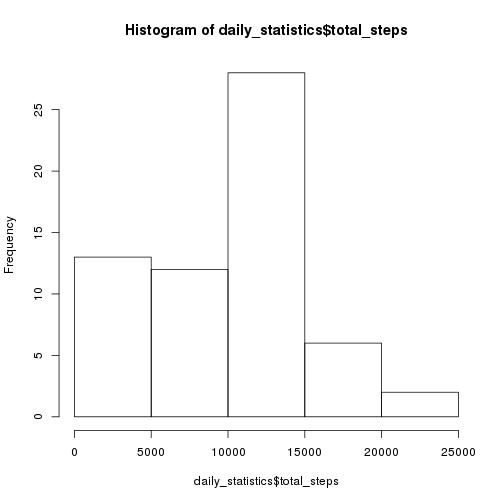
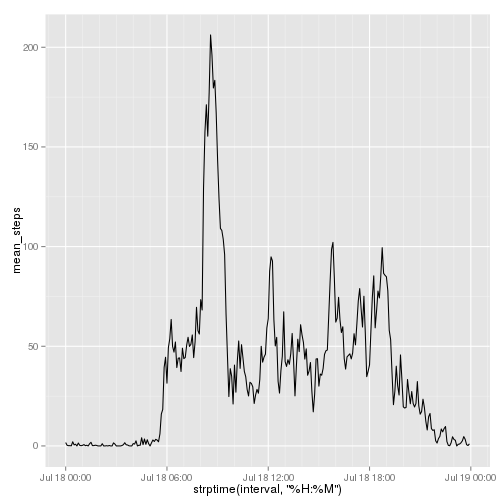
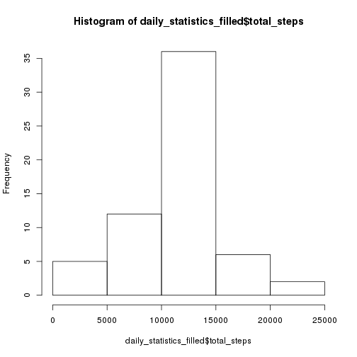
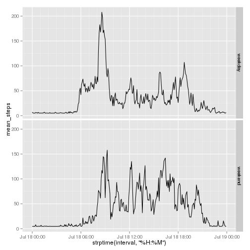

## Loading and preprocessing the data

```r
## Set default to echo code
opts_chunk$set(echo=TRUE)

## load data
file_raw_data <- "./activity.zip"
zip_file_info <- unzip(file_raw_data, list=TRUE)
raw_data <- read.csv(unz(file_raw_data, as.character(zip_file_info$Name)), header=TRUE, stringsAsFactors=FALSE)

## pre-process data
library(lubridate)
preprocessed_data <- raw_data
preprocessed_data$date <- parse_date_time(preprocessed_data$date, "ymd")
preprocessed_data$interval <- sprintf("%04d", preprocessed_data$interval)
preprocessed_data$interval <- paste(substr(preprocessed_data$interval, 1, 2), ":", substr(preprocessed_data$interval, 3, 4), sep="")
```


## What is mean total number of steps taken per day?

```r
library(dplyr)
## Calculate the total number of steps taken per day
daily_statistics <-
    preprocessed_data %>%
        group_by(date) %>%
            summarise(total_steps = sum(steps, na.rm=TRUE))

## Make a histogram of the total number of steps taken each day
hist(daily_statistics$total_steps)
```

 

```r
## Calculate and report the mean and median of the total number of steps taken per day
mean(daily_statistics$total_steps)
```

```
## [1] 9354.23
```

```r
median(daily_statistics$total_steps)
```

```
## [1] 10395
```


## What is the average daily activity pattern?


```r
# Make a time series plot (i.e. type = "l") of the 5-minute interval (x-axis) and the average number of steps taken, averaged across all days (y-axis)
daily_activity_pattern <-
    preprocessed_data %>%
        group_by(interval) %>%
            summarise(mean_steps = mean(steps, na.rm=TRUE))

library(scales)
ggplot(data=daily_activity_pattern, aes(x=strptime(interval, "%H:%M"), y=mean_steps)) + geom_line() + scale_x_datetime(minor_breaks="1 hour")
```

 

```r
## Which 5-minute interval, on average across all the days in the dataset, contains the maximum number of steps?
filter(daily_activity_pattern, mean_steps==max(mean_steps))
```

```
## Source: local data frame [1 x 2]
## 
##   interval mean_steps
## 1    08:35   206.1698
```
### TBD
In R, no time class, only date-time class. How to hide dates in xticks?

## Imputing missing values

Note that there are a number of days/intervals where there are missing
values (coded as NA). The presence of missing days may introduce bias
into some calculations or summaries of the data.


```r
## Calculate and report the total number of missing values in the dataset (i.e. the total number of rows with NAs)
sum(is.na(preprocessed_data$steps))
```

```
## [1] 2304
```

```r
## Create a new dataset that is equal to the original dataset but with the missing data filled in.
filled_preprocessed_data <- preprocessed_data
filled_preprocessed_data[is.na(filled_preprocessed_data), ]$steps <- mean(filled_preprocessed_data$steps, na.rm=TRUE)

## Make a histogram of the total number of steps taken each day and
## Calculate and report the mean and median total number of steps
## taken per day. Do these values differ from the estimates from the
## first part of the assignment? What is the impact of imputing
## missing data on the estimates of the total daily number of steps?
daily_statistics_filled <-
    filled_preprocessed_data %>%
        group_by(date) %>%
            summarise(total_steps = sum(steps, na.rm=TRUE))
hist(daily_statistics_filled$total_steps)
```

 

```r
mean(daily_statistics_filled$total_steps)
```

```
## [1] 10766.19
```

```r
median(daily_statistics_filled$total_steps)
```

```
## [1] 10766.19
```


## Are there differences in activity patterns between weekdays and weekends?

For this part the weekdays() function may be of some help here. Use the dataset with the filled-in missing values for this part.


```r
## Create a new factor variable in the dataset with two levels – “weekday” and “weekend” indicating whether a given date is a weekday or weekend day.
filled_preprocessed_data <- mutate(filled_preprocessed_data, date_type=as.factor(ifelse(weekdays(date)=="Saturday"|weekdays(date)=="Sunday", "weekend", "weekday")))

## Make a panel plot containing a time series plot (i.e. type = "l")
## of the 5-minute interval (x-axis) and the average number of steps
## taken, averaged across all weekday days or weekend days (y-axis).
daily_activity_pattern <-
    filled_preprocessed_data %>%
        group_by(interval, date_type) %>%
            summarise(mean_steps = mean(steps, na.rm=TRUE))
ggplot(data=daily_activity_pattern, aes(x=strptime(interval, "%H:%M"), y=mean_steps)) + geom_line() + scale_x_datetime(minor_breaks="1 hour") + facet_grid(date_type~.)
```

 

```r
tmp <- filled_preprocessed_data %>%
    group_by(date_type, interval) %>%
        summarise(mean_step=mean(steps))


filter(tmp, date_type=="weekday" & mean_step==max(mean_step))
```

```
## Source: local data frame [1 x 3]
## Groups: date_type
## 
##   date_type interval mean_step
## 1   weekday    08:35  207.8732
```

```r
filter(tmp, date_type=="weekend" & mean_step==max(mean_step))
```

```
## Source: local data frame [1 x 3]
## Groups: date_type
## 
##   date_type interval mean_step
## 1   weekend    09:15  157.7978
```


